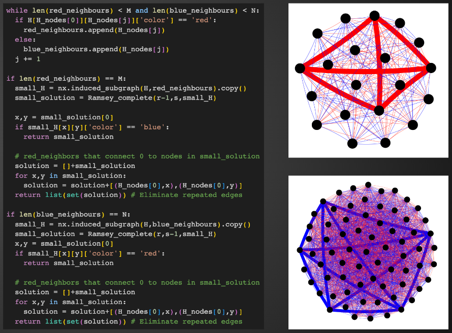

# Ramsey functions

## About

This project was part of the 2023 <a href="https://www.mathematics.utoronto.ca/outreach/current-programs/grades-9-12-programs/math-mentorship">University of Toronto Mathematics Mentorship Program</a> and presented at the <a href="http://www.fields.utoronto.ca/activities/22-23/CUMC2023">2023 Canadian Undergraduate Mathematics Conference</a>.

### Developed by

- Amber Bajaj (mentee) 
- Tonatiuh Matos Wiederhold (mentor) 
  Dept. of Mathematics, University of Toronto, Canada. 
  tonamatos@gmail.com

---

<table>
<tr>
<td>
This repo contains three things:

- Custom-made visualization tools appropriate for Ramsey theory. E.g., highlighting monochromatic copies of subgraphs within large networks.
- Efficient algorithms to compute monochromatic copies of sought subgraphs within large networks. E.g. `FindMonochTriangle(H)` returns a list of three edges of the same color in constant time.
- Applications of the above functions to other areas: solving colored linear equations, finding long monotone sublists, etc.

</td>
<td>

</td>
</tr>
</table>

---
